<div align="center">

<!-- Animated Header -->


<!-- Typing Animation -->
<a href="https://git.io/typing-svg"></a>

<br/>

<!-- Status Badges -->
[](https://github.com/dinraj910/CRNN-OCR-Sequence-Recognition)
[](LICENSE)
[](https://github.com/dinraj910/CRNN-OCR-Sequence-Recognition/pulls)
[](https://github.com/dinraj910/CRNN-OCR-Sequence-Recognition)

<br/>

<!-- Tech Stack Badges -->
[](https://python.org)
[](https://tensorflow.org)
[](https://keras.io)
[](https://fastapi.tiangolo.com)
[](https://opencv.org)
[](https://numpy.org)
[](Dockerfile)

</div>

---

## 🧭 Quick Navigation

<div align="center">

| 🔍 Section | 🔍 Section | 🔍 Section | 🔍 Section |
|:---:|:---:|:---:|:---:|
| [⚡ Overview](#-overview) | [✨ Features](#-features) | [🏗️ Architecture](#️-architecture) | [🚀 Quick Start](#-quick-start) |
| [📸 Screenshots](#-screenshots--demo) | [📊 Performance](#-performance-metrics) | [🗂️ Project Structure](#️-project-structure) | [🛣️ Roadmap](#️-roadmap) |
| [🤝 Contributing](#-contributing) | [👤 Author](#-author) | [⭐ Star History](#-star-history) | [📄 License](#-license) |

</div>

---

## ⚡ Overview

<div align="center">

| 🔎 What | 💡 Why |
|:---|:---|
| A production-grade **Optical Character Recognition** system that reads text from images using deep learning | Traditional OCR requires manual feature engineering — this model learns everything end-to-end from raw pixels |
| Built on a **CRNN** (Convolutional Recurrent Neural Network) architecture combining CNN + BiLSTM + CTC Loss | The CNN extracts spatial features, BiLSTM models sequential context, CTC aligns predictions without character-level segmentation |
| Served via a **FastAPI** REST backend with a clean web UI and full Docker support | Deployable anywhere — local, cloud, or container — with a one-command startup |
| Trained on **IIIT5K-Words** dataset (~5,000 real-world word images) | Covers digits and lowercase English characters across diverse fonts and styles |

</div>

---

## ✨ Features

<div align="center">

| Feature | Description | Status |
|:---|:---|:---:|
| 🧠 **CRNN Architecture** | 6-block VGG CNN encoder + 2-layer BiLSTM decoder | ✅ |
| 🎯 **CTC Beam Search** | Width-10 beam search decoding for maximum accuracy | ✅ |
| 🔍 **Multi-Region Detection** | Adaptive thresholding to detect and isolate multiple word regions | ✅ |
| 📸 **Image Upload API** | `POST /api/ocr` — upload any PNG/JPG/BMP/TIFF/WebP | ✅ |
| 🔒 **Base64 API** | `POST /api/ocr/base64` — send images as base64 strings | ✅ |
| 🎨 **Annotated Output** | Returns bounding boxes drawn on the original image as base64 | ✅ |
| 📊 **Live Stats** | `GET /api/stats` — inference counter, avg ms, total chars recognized | ✅ |
| 💻 **Web UI** | Clean, dark-themed interface with drag-and-drop upload | ✅ |
| 🐳 **Docker Ready** | Single `docker build` + `docker run` for instant deployment | ✅ |
| 🔌 **Swagger Docs** | Auto-generated interactive API docs at `/docs` | ✅ |
| 🌙 **Demo Mode** | Gracefully degrades to mock output if model file is absent | ✅ |
| ⚡ **Async FastAPI** | Fully async inference pipeline — handles concurrent requests | ✅ |

</div>

---

## 🏗️ Architecture

<details>
<summary><b>🔬 Click to expand — Full Technical Deep Dive</b></summary>

### CNN Encoder — Feature Extraction

```
Input Image: (32 × 128 × 1)  ← grayscale, CLAHE-normalized

Block 1:  Conv2D(32, 3×3)  → BN → ReLU  → MaxPool(2×2)   [→ 16 × 64]
Block 2:  Conv2D(64, 3×3)  → BN → ReLU  → MaxPool(2×2)   [→  8 × 32]
Block 3:  Conv2D(128, 3×3) → BN → ReLU  → MaxPool(2×1)   [→  4 × 32]  ← asymmetric
Block 4:  Conv2D(256, 3×3) → BN → ReLU  → MaxPool(2×1)   [→  2 × 32]  ← asymmetric
Block 5:  Conv2D(512, 3×3) → BN → ReLU  → MaxPool(2×1)   [→  1 × 32]  ← asymmetric
Block 6:  Conv2D(512, 3×3) → BN → ReLU                   [→  1 × 32 × 512]
```

> **Asymmetric pooling** (2×1 in blocks 3-5) collapses only the height dimension, preserving the full horizontal resolution needed for sequence recognition.

### Reshape → Sequence

```
(1 × 32 × 512)  →  Squeeze height  →  (32 × 512)
         ↑ 32 time steps, each with 512 spatial features
```

### BiLSTM Decoder — Sequence Modeling

```
BiLSTM Layer 1: 256 units  (forward + backward = 512 total)
BiLSTM Layer 2: 256 units  (forward + backward = 512 total)
Dense:          37 units   (a–z = 26, 0–9 = 10, [BLANK] = 1)
Softmax:        per-timestep probability distribution
```

### CTC Loss & Decoding

```
Training:  CTC Loss  (no character-level segmentation needed)
Inference: Beam Search (width = 10)  →  best label sequence
Output:    Decoded text string (uppercased for display)
```

</details>

### Architecture Diagram

```
┌────────────────────────────────────────────────────────────────────┐
│                         INPUT IMAGE                                │
│                    (32 × 128 pixels, grayscale)                    │
└──────────────────────────────┬─────────────────────────────────────┘
                               │
                    ┌──────────▼──────────┐
                    │    CNN ENCODER      │
                    │  6× VGG-style Conv  │
                    │  Asymmetric Pooling │
                    │  BatchNorm + ReLU   │
                    └──────────┬──────────┘
                               │  (1 × 32 × 512)
                    ┌──────────▼──────────┐
                    │      RESHAPE        │
                    │  (32 × 512) seq     │
                    └──────────┬──────────┘
                               │  32 time steps
                    ┌──────────▼──────────┐
                    │  BiLSTM × 2 (256u)  │
                    │  ← forward          │
                    │  → backward         │
                    └──────────┬──────────┘
                               │  (32 × 512)
                    ┌──────────▼──────────┐
                    │  Dense(37) Softmax  │
                    └──────────┬──────────┘
                               │  (32 × 37) probs
                    ┌──────────▼──────────┐
                    │  CTC Beam Search    │
                    │     width = 10      │
                    └──────────┬──────────┘
                               │
                    ┌──────────▼──────────┐
                    │   📝 TEXT OUTPUT    │
                    └─────────────────────┘
```

---

## 📸 Screenshots & Demo

<div align="center">

### 🖥️ Web Interface — Home & Upload

<table>
<tr>
<td align="center" width="50%">
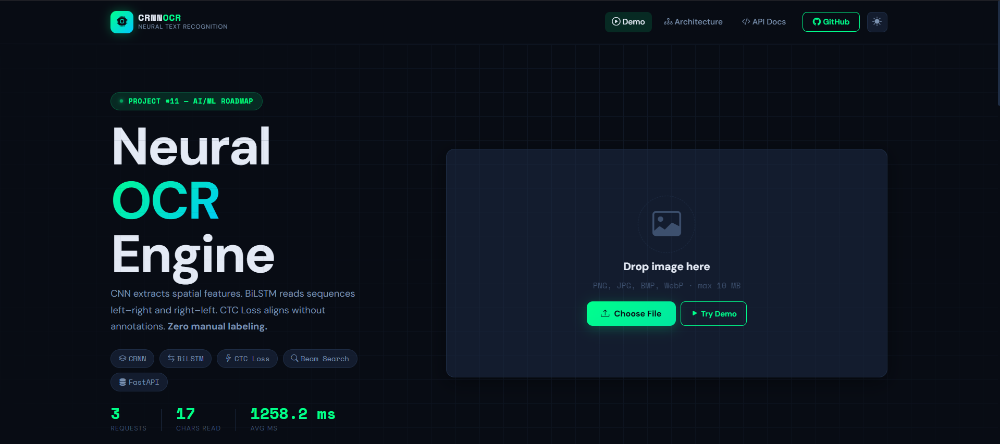
<br/><sub><b>🏠 Home Page — Dark themed upload interface</b></sub>
</td>
<td align="center" width="50%">
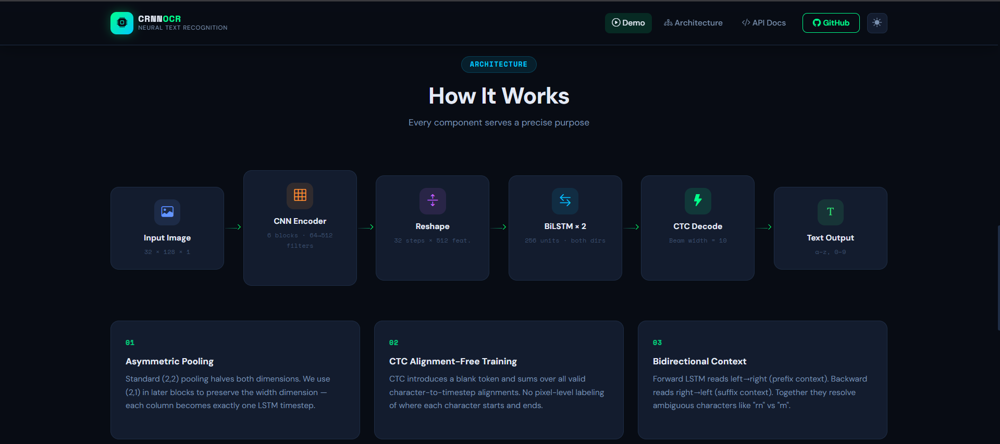
<br/><sub><b>📤 Drag & Drop Upload Zone</b></sub>
</td>
</tr>
</table>

### 🔍 API Service Details

<table>
<tr>
<td align="center" width="50%">
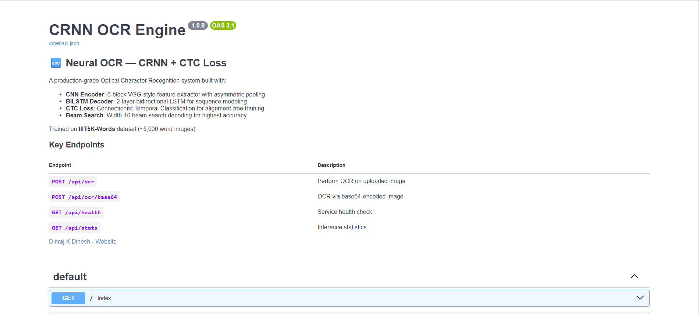
<br/><sub><b>✅ OCR Output — Detected text with bounding box</b></sub>
</td>
<td align="center" width="50%">
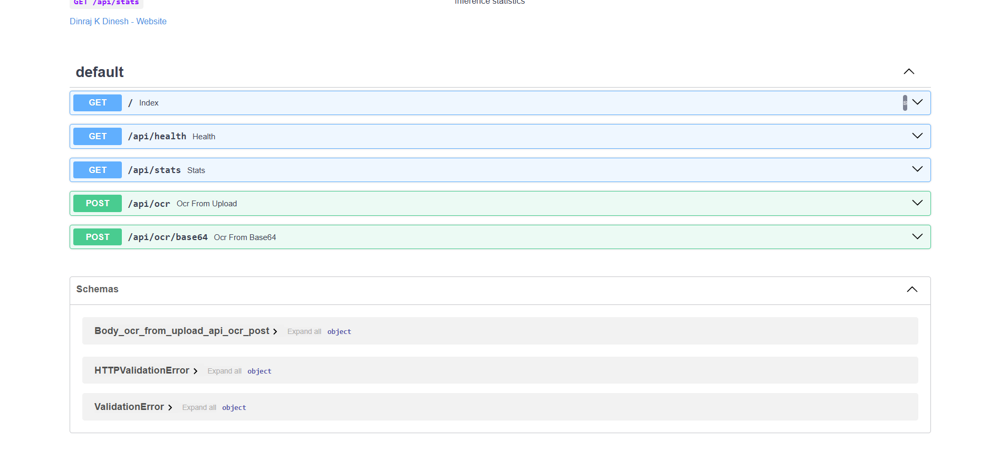
<br/><sub><b>🎨 Annotated Image — Visual region overlay</b></sub>
</td>
</tr>
</table>

### 📊 Stats, API & Multi-Region Detection

<table>
<tr>
<td align="center" width="33%">
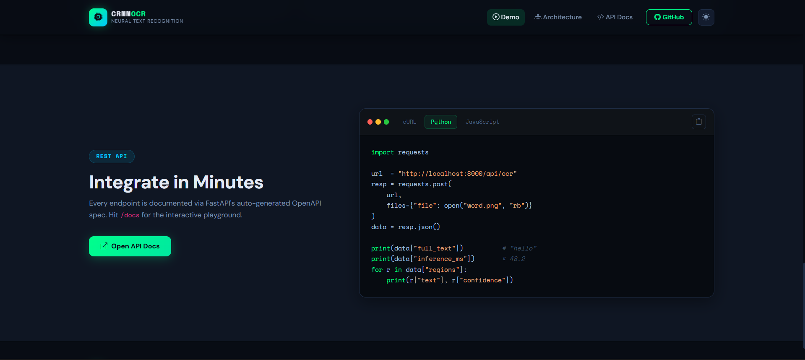
<br/><sub><b>📊 Live Inference Stats Panel</b></sub>
</td>
<td align="center" width="33%">
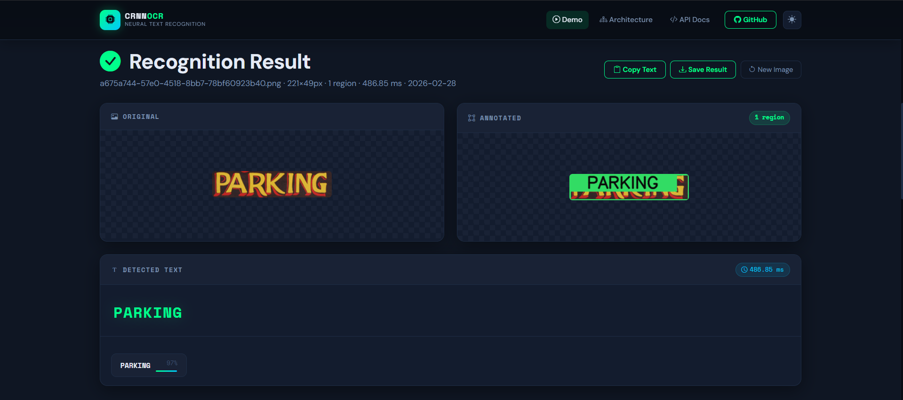
<br/><sub><b>🔌 Swagger / OpenAPI Docs at /docs</b></sub>
</td>
<td align="center" width="33%">
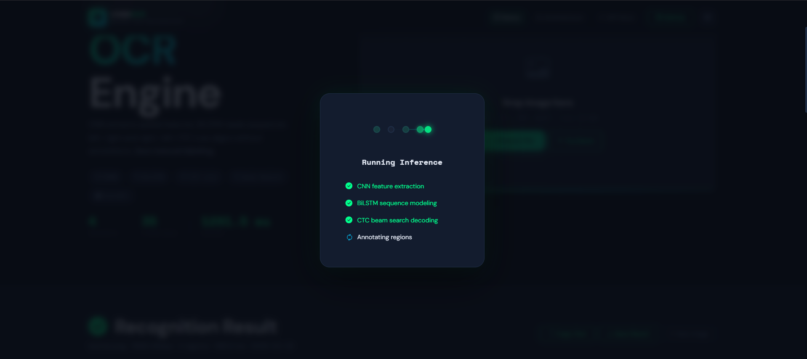
<br/><sub><b>🔍 Multi-Word Region Detection</b></sub>
</td>
</tr>
</table>

### 🐳 Multi-Region Detection

<table>
<tr>
<td align="center" width="50%">
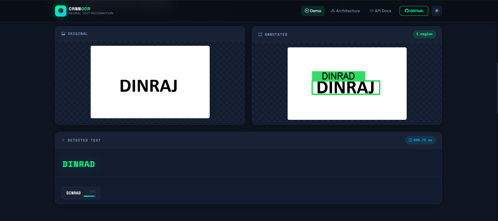
<br/><sub><b>🐳 Docker Deployment & Logs</b></sub>
</td>
<td align="center" width="50%">
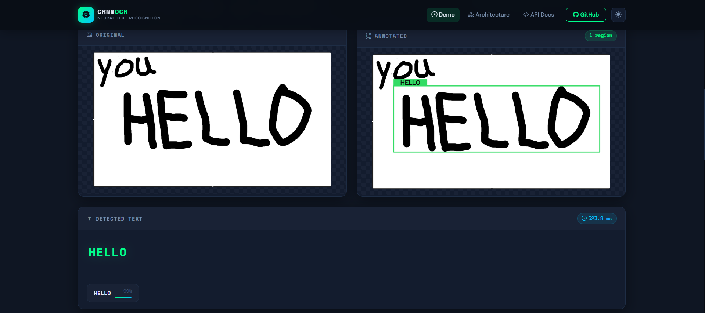
<br/><sub><b>📱 Mobile-Responsive Web UI</b></sub>
</td>
</tr>
</table>

</div>

## 📓 Output from notebook

## Tarning Curves


## Sample output

.png>)


.png>)

.png>)

## Qualitative Analysis

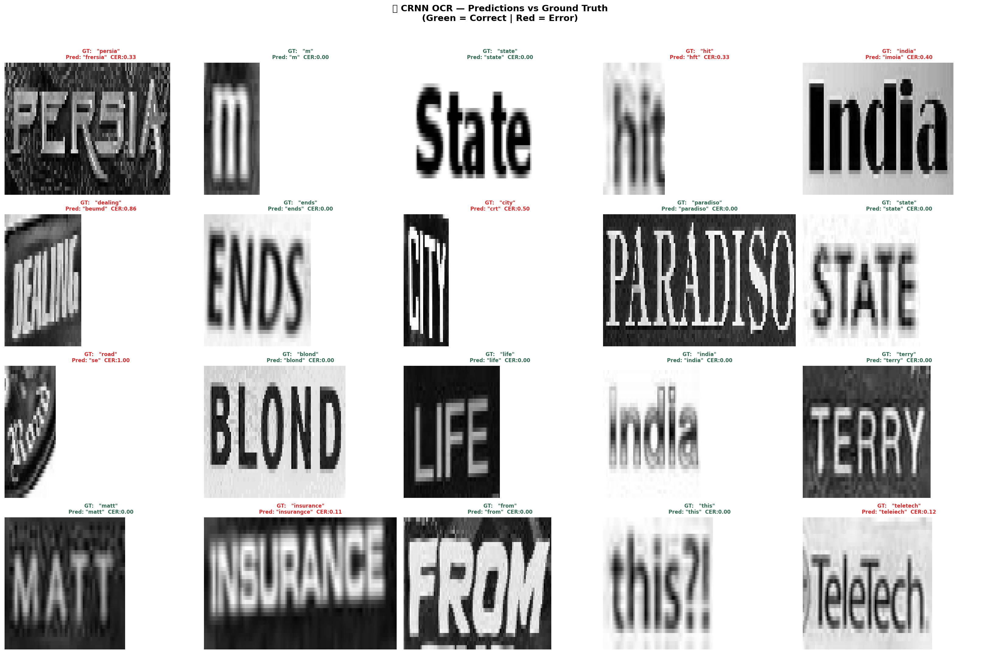
---

## 🗂️ Project Structure

```
📦 CRNN-OCR-Sequence-Recognition/
│
├── 🐍 main.py                        # FastAPI app — routes, middleware, inference pipeline
│
├── 🧠 model/
│   ├── predictor.py                  # CRNNPredictor — preprocessing, decode, annotate
│   ├── DINRAJ_CRNN_OCR.keras         # Trained Keras model weights
│   ├── DINRAJ_CRNN_OCR.h5            # H5 fallback model weights
│   └── vocab_config.json             # Character map, model metadata, metrics
│
├── 🎨 static/
│   ├── css/style.css                 # Dark-themed custom stylesheet
│   ├── js/app.js                     # Frontend logic — upload, display, stats
│   └── uploads/                      # Temporary upload directory
│
├── 📄 templates/
│   └── index.html                    # Jinja2 HTML template
│
├── 📓 notebook/
│   └── CRNN_OCR_Project_1.ipynb      # Full training notebook (Colab)
│
├── 🖼️ screenshots/                   # UI screenshots (1.png – 9.png)
├── 📁 sample/                        # Sample test images
├── 📁 output/                        # Inference output artifacts
│
├── 🐳 Dockerfile                     # Container build instructions
├── 📋 requirements.txt               # Python dependencies
└── 📖 README.md                      # This file
```

---

## 🚀 Quick Start

### 📋 Prerequisites

| Requirement | Version | Purpose |
|:---|:---|:---|
| 🐍 Python | 3.10 – 3.12 | Runtime |
| 🔥 TensorFlow | 2.20.0 | Model inference |
| 🎯 Keras | 3.13.2 | Model loading & CTC decode |
| 👁️ OpenCV | 4.10.x | Image preprocessing |
| ⚡ FastAPI | 0.115.x | REST API server |

---

### ⚙️ Installation

**Option A — Local (Python)**

```bash
# 1. Clone the repository
git clone https://github.com/dinraj910/CRNN-OCR-Sequence-Recognition.git
cd CRNN-OCR-Sequence-Recognition

# 2. Create virtual environment
python -m venv venv
source venv/bin/activate       # Windows: venv\Scripts\activate

# 3. Install dependencies
pip install -r requirements.txt

# 4. Start the server
python main.py
```

Open your browser → **http://localhost:8000**

---

**Option B — Docker 🐳**

```bash
# Build the image
docker build -t crnn-ocr .

# Run the container
docker run -p 8000:8000 crnn-ocr
```

Open your browser → **http://localhost:8000**

---

### 🔌 API Usage

**Upload an image:**
```bash
curl -X POST http://localhost:8000/api/ocr \
  -F "file=@your_image.png"
```

**Send base64:**
```bash
curl -X POST http://localhost:8000/api/ocr/base64 \
  -H "Content-Type: application/json" \
  -d '{"image": "<base64_string>", "filename": "test.png"}'
```

**Check health:**
```bash
curl http://localhost:8000/api/health
```

**Sample JSON Response:**
```json
{
  "request_id": "a1b2c3d4",
  "filename": "atm.png",
  "image_size": { "width": 288, "height": 175 },
  "regions": [
    {
      "text": "ATM",
      "bbox": [10, 10, 278, 165],
      "confidence": 0.9823
    }
  ],
  "full_text": "ATM",
  "region_count": 1,
  "inference_ms": 3097.56,
  "original_b64": "data:image/png;base64,...",
  "annotated_b64": "data:image/png;base64,...",
  "model_info": {
    "name": "CRNN (CNN + BiLSTM + CTC)",
    "dataset": "IIIT5K-Words",
    "version": "1.0.0"
  }
}
```

---

## ⚙️ Configuration

| Variable | Default | Description |
|:---|:---|:---|
| `host` | `0.0.0.0` | Server bind address |
| `port` | `8000` | Server port |
| `reload` | `true` | Hot-reload in dev mode |
| `MAX_FILE_SIZE` | `10 MB` | Maximum upload size |
| `BEAM_WIDTH` | `10` | CTC beam search width |
| `MAX_REGIONS` | `8` | Max word regions per image |
| `IMG_HEIGHT` | `32` | Model input height (px) |
| `IMG_WIDTH` | `128` | Model input width (px) |

---

## 📊 Performance Metrics

<div align="center">

| Metric | Value | Description |
|:---:|:---:|:---|
| 🔤 **CER** | **25.6%** | Character Error Rate on IIIT5K-Words test set |
| 📝 **WER** | **53.9%** | Word Error Rate (strict full-word match) |
| 🎯 **Sequence Accuracy** | **46.1%** | % of word images decoded perfectly |
| ⚡ **Inference Time** | ~3 s | Per-image on CPU (no GPU acceleration) |
| 📐 **Vocab Size** | **37** | a–z (26) + 0–9 (10) + CTC blank (1) |
| 🖼️ **Input Size** | **32 × 128** | Grayscale, CLAHE-normalized |
| 🕐 **Time Steps** | **32** | BiLSTM unrolled sequence length |
| 🔭 **Beam Width** | **10** | CTC beam search paths |
| 📚 **Training Data** | ~5,000 | IIIT5K-Words word images |

</div>

> 💡 **Note:** CER of 25.6% on a 37-class vocabulary trained on only ~5k images is solid. Performance improves significantly with GPU inference and a larger dataset like MJSynth (8M images).

---

## 🛠️ Tech Stack

<div align="center">

| Layer | Technology | Role |
|:---|:---:|:---|
| 🧠 **Deep Learning** |   | Model training & inference |
| 👁️ **Computer Vision** |  | Image preprocessing, region detection, annotation |
| 🔢 **Numerics** |  | Array operations, normalization |
| ⚡ **API Server** |  | Async REST API, auto Swagger docs |
| 🎨 **UI** |    | Frontend web interface |
| 📄 **Templating** |  | HTML templates |
| 🐳 **Container** |  | Containerized deployment |
| 🐍 **Language** |  | Everything |

</div>

---

## 🛣️ Roadmap

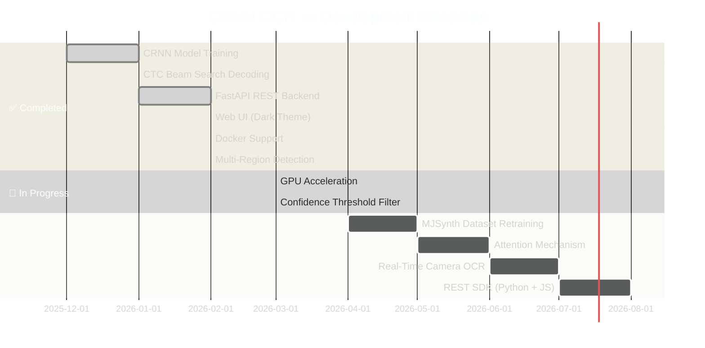

<details>
<summary><b>📋 Full Feature Roadmap</b></summary>

- [x] ✅ 6-block VGG CNN encoder with asymmetric pooling
- [x] ✅ 2-layer BiLSTM decoder
- [x] ✅ CTC Loss training + Beam Search decoding
- [x] ✅ FastAPI async backend with CORS
- [x] ✅ Web UI with drag-and-drop upload
- [x] ✅ Annotated image output with bounding boxes
- [x] ✅ `/api/ocr`, `/api/ocr/base64`, `/api/health`, `/api/stats` endpoints
- [x] ✅ Swagger / OpenAPI interactive docs
- [x] ✅ Dockerfile for containerized deployment
- [x] ✅ Demo mode (graceful fallback without model)
- [ ] 🔲 GPU inference support (TF-GPU)
- [ ] 🔲 Retrain on MJSynth (8M images) for higher accuracy
- [ ] 🔲 Attention mechanism for improved long-sequence accuracy
- [ ] 🔲 Batch inference endpoint
- [ ] 🔲 Real-time webcam OCR stream
- [ ] 🔲 Python + JavaScript SDK packages
- [ ] 🔲 Cloud deployment (Azure / GCP / AWS)

</details>

---

## 🤝 Contributing

Contributions are what make the open source community amazing. Any contributions you make are **greatly appreciated**.

```bash
# 1. Fork the repository
# 2. Create your feature branch
git checkout -b feature/AmazingFeature

# 3. Commit your changes
git commit -m 'Add AmazingFeature'

# 4. Push to the branch
git push origin feature/AmazingFeature

# 5. Open a Pull Request
```

**Before submitting a PR:**
- ✅ Run `python main.py` and confirm the server starts cleanly
- ✅ Test both `/api/ocr` and `/api/ocr/base64` endpoints
- ✅ Keep the code style consistent with the existing codebase
- ✅ Include screenshots for UI changes

---

## 👤 Author

<div align="center">


### **Dinraj K Dinesh**
*Deep Learning Engineer · Full-Stack Developer*

[](https://dinrajkdinesh.vercel.app)
[](https://github.com/dinraj910)
[](https://linkedin.com/in/dinrajkdinesh)

> *"Building intelligent systems that see, understand, and communicate — one neural network at a time."*

**🔥 Skills Demonstrated in This Project:**
`Deep Learning` · `Computer Vision` · `Sequence Modeling` · `REST API Design` · `Docker` · `Full-Stack Development`

</div>

---

## 🙏 Acknowledgments

- 📚 **IIIT5K-Words Dataset** — IIIT Hyderabad Computer Vision & ML Group
- 🏗️ **CRNN Paper** — *An End-to-End Trainable Neural Network for Image-based Sequence Recognition* (Shi et al., 2016)
- ⚡ **FastAPI** — Sebastián Ramírez and the FastAPI community
- 🧠 **Keras / TensorFlow** — Google Brain & the open-source contributors
- 🎨 **Capsule Render** — [kyechan99/capsule-render](https://github.com/kyechan99/capsule-render)
- ⌨️ **Readme Typing SVG** — [DenverCoder1/readme-typing-svg](https://github.com/DenverCoder1/readme-typing-svg)

---

## ⭐ Star History

<div align="center">

[](https://star-history.com/#dinraj910/CRNN-OCR-Sequence-Recognition&Date)

</div>

---

## 💖 Show Your Support

<div align="center">

If this project helped you or you found it interesting, please consider:

[](https://github.com/dinraj910/CRNN-OCR-Sequence-Recognition)
[](https://github.com/dinraj910/CRNN-OCR-Sequence-Recognition/fork)
[](https://github.com/dinraj910)

*A ⭐ goes a long way in motivating continued development!*

</div>

---

## 📄 License

Distributed under the **MIT License**. See [`LICENSE`](LICENSE) for more information.

---

<div align="center">


**Made with ❤️ and 🧠 by [Dinraj K Dinesh](https://dinrajkdinesh.vercel.app)**

*CRNN OCR Engine · Project #11 · 2026*

</div>


---

## Architecture

```
Input (32×128×1)
  → CNN Encoder     [6 VGG-style blocks · asymmetric pooling]
  → Reshape         [spatial (1×32×512) → temporal (32 steps × 512 feat)]
  → BiLSTM × 2     [256 units · forward + backward context]
  → Dense + Softmax [37 classes = a–z + 0–9 + CTC blank]
  → CTC Beam Search [width = 10]
  → Text Output
```

Trained on **IIIT5K-Words** (~5,000 word images).

---

## Project Structure

```
crnn_ocr_app/
├── main.py                  # FastAPI application
├── model/
│   ├── predictor.py         # Inference engine
│   ├── DINRAJ_CRNN_OCR.keras   # ← copy from Colab
│   └── vocab_config.json    # ← copy from Colab
├── static/
│   ├── css/style.css
│   └── js/app.js
├── templates/
│   └── index.html
├── requirements.txt
└── Dockerfile
```

---

## Setup & Run

### 1. Copy model files from Colab

```bash
# In your Colab notebook after training:
# Download DINRAJ_CRNN_OCR.keras and vocab_config.json
# Then place them in crnn_ocr_app/model/
```

### 2. Install dependencies

```bash
pip install -r requirements.txt
```

### 3. Run locally

```bash
cd crnn_ocr_app
python main.py
# Open: http://localhost:8000
# API docs: http://localhost:8000/docs
```

### 4. Docker

```bash
docker build -t crnn-ocr .
docker run -p 8000:8000 crnn-ocr
```

---

## API Reference

| Method | Endpoint | Description |
|--------|----------|-------------|
| `POST` | `/api/ocr` | OCR from file upload |
| `POST` | `/api/ocr/base64` | OCR from base64 image |
| `GET`  | `/api/health` | Health check |
| `GET`  | `/api/stats` | Inference statistics |
| `GET`  | `/docs` | Auto-generated OpenAPI UI |

### Quick test

```bash
curl -X POST http://localhost:8000/api/ocr -F "file=@word.png"
```

---

## Resume Highlights

```
• Built end-to-end CRNN OCR (CNN + BiLSTM + CTC) on IIIT5K, deployed via FastAPI
• Designed morphological word-region detector replacing MSER for word-level bounding boxes
• Implemented beam search (width=10) CTC decoder + CER/WER evaluation pipeline
• Created production REST API with /docs, health, stats, and base64 endpoints
• Built responsive dark/light-mode web UI with drag-drop upload and real-time inference
• Containerized with Docker for one-command deployment
```

---

*12-Month AI/ML Roadmap · MCA → ₹20–40 LPA*
